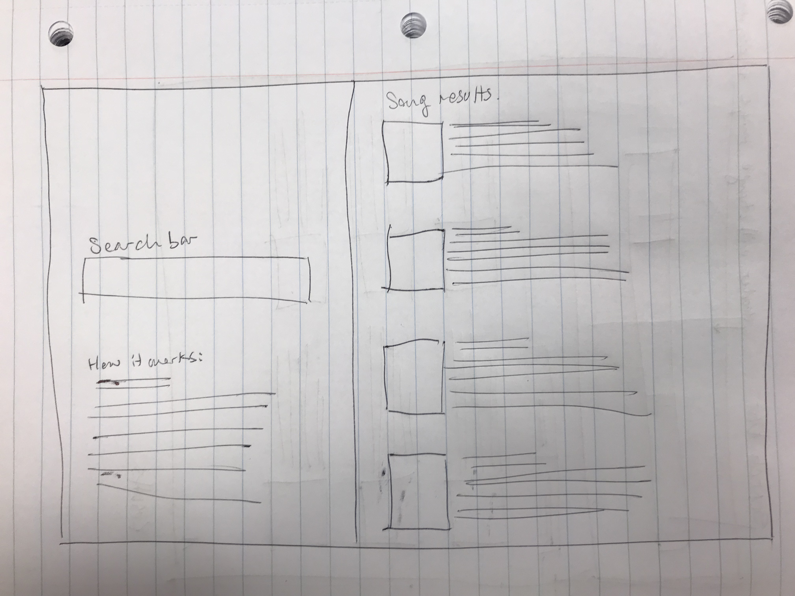

# Project 1
UT Austin Coding Bootcamp \
Project Team: Didi Ramsamooj, Efren Cavazos, Ezequiel Calderon \
Project Launch - October 10, 2018

## Project Proposals
We have two proposals: 
+ 1) Events curation guide (were told was too easy)
+ 2) Music and lights synchronicity app (were told was recommended for difficulty)

### 1) What Todoo?
Events curation guide. Events and attractions in your city of things to do indoor or outdoor. Search from events by date, ratings or popularity, and share an event with a friend for concerts, food, theatre, art exhibitions and more! So what todoo?!

### 2) Spotify Party Lights
Use Spotify music to control the hue of Philips Hue bulbs. With every oscilliation in sound wave, the Philips Hue bulb will automatically adjust to match the Spotify music. We'll need to research how to push sound waves into the Philips Hue wave form and API. 

## Rough Sketch of Final Product
What Todoo?

\
Spotify Party Lights

## APIs to be Used
### 1) What Todoo?
+ [https://developer.ticketmaster.com/](TicketMaster API) \
+ [https://www.eventbrite.com/developer/v3/](Eventbrite API) \
+ [https://api.guidebox.com/](Movies API)

### 2) Spotify Party Lights
+ [https://www.developers.meethue.com/](Philips Hue API) \
+ [https://developer.spotify.com/documentation/web-api/](Spotify API)

## Rough Breakdown of Tasks
+ Determine roles
+ Determine scope of development
+ Research feasibility of using Philips Hue and Spotify
+ Begin working on features
