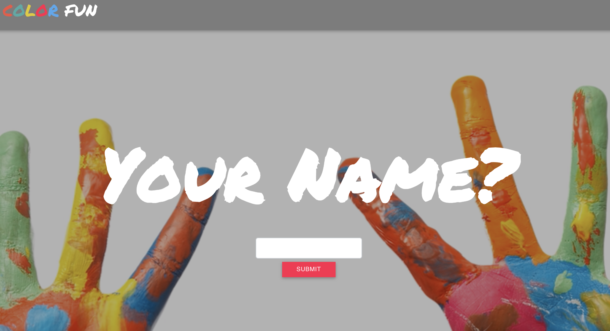

# Color Fun :art:  :art:
UT Austin Coding Bootcamp | Project 1 \
[https://playeasynow.github.io/ProjectWonTeamWon/](https://playeasynow.github.io/ProjectOneTeamWon/) \
v1.0 \
Orig. Deployment - October 10, 2018

# Idea
It's a color game for kids! We used the tracking.js library, the Unsplash API and the GIPHY API to create a fun game of guessing the right color. A user is shown an image with a distinct color, and then asked to find an object with a matching color and then show it to the camera.

# User Guide

Here's how it works:

- You have an initial form where you must type in a name and then hit the submit button. There is an instructions handle that is visible on the left side of the screen.
- When you click submit, the page will hide the input form and submit button, and then display the name entered on the navbar. Then, the page will show three buttons:  Play, Pause, Reset. Play will be pulsing.
- Click on the Play button. If its a user's first time, then the page will ask to enable the camera of the user. Then, a 30-second countdown will display as well as the color the user needs to match.
- Find an object with a similar color. Show it to the camera. Use the live video feed as a reference of what the camera is capturing. 
- When an object matches, the site will pop up a modal that determins a win or loss. The page will keep track of # of wins.
- There are 5 colors to match.
- Have fun!

P.S. a chat box is available to use to chat with other players. *Not enabled in V1*.

# Built Utilizing: 
SVG images and animations \
Bootstrap v4 - <https://stackpath.bootstrapcdn.com/bootstrap/4.1.3/css/bootstrap.min.css> \
Material Design for Bootstrap 4 - <https://mdbootstrap.com/material-design-for-bootstrap/> \
jQuery 3.x - <http://code.jquery.com/jquery-3.3.1.min.js> 
trackingJS - <https://trackingjs.com/>

# Original Contributors:
Didi Ramsamooj - <https://github.com/DiDi1081>
Efren Cavazos - <https://github.com/EfrenCav>
Ezequiel Calderon - <https://github.com/playeasynow>

# Get Involved!
If you have any recommendations, let us know! Email: ezequiel.calderon.jr@gmail.com. If you'd like to take it in your own direction, go right ahead. 
